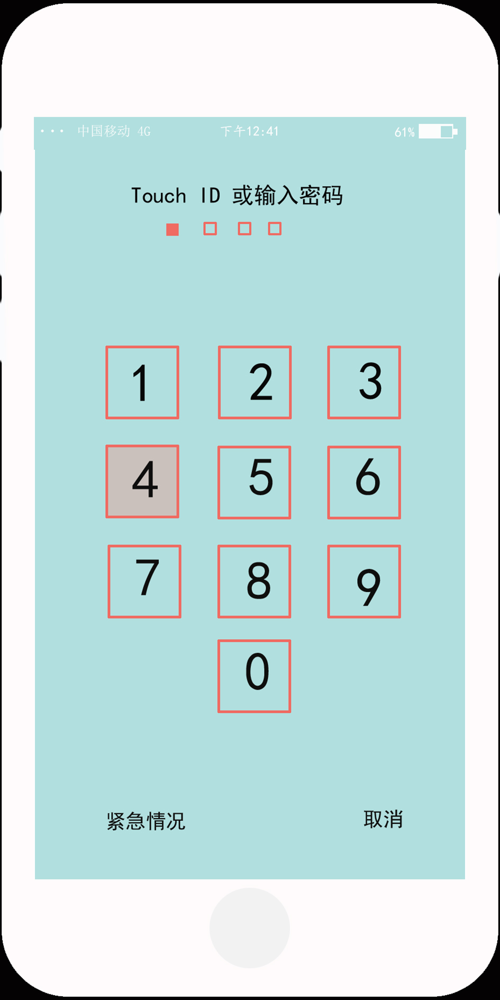
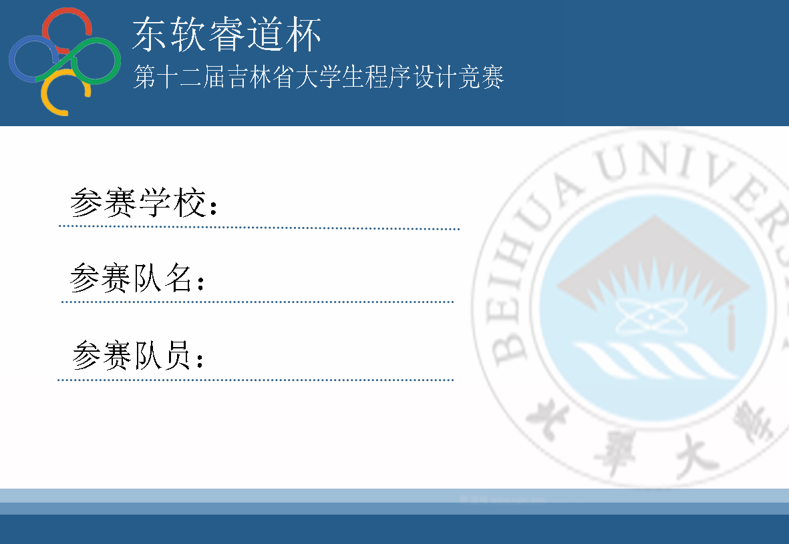

 一、Photoshop模拟手机页面
 ======================
 1.完成情况
 ---------
（1）该项目为大三学年大连冬令营自行完成，项目完成大概两天时间。
 
（2）其中项目中每个手机app均为模仿真实手机自行设计。
 
（3）利用Photoshop中画图、抠图、合成等手法完成。
2.效果图
--------
    
    
    

二、设计吉林省第十二届大学生程序设计竞赛参赛牌
========================================
效果图
-----

